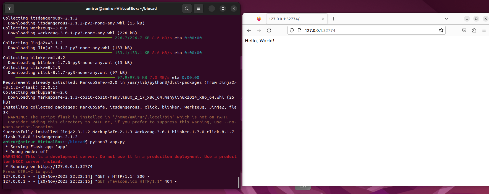
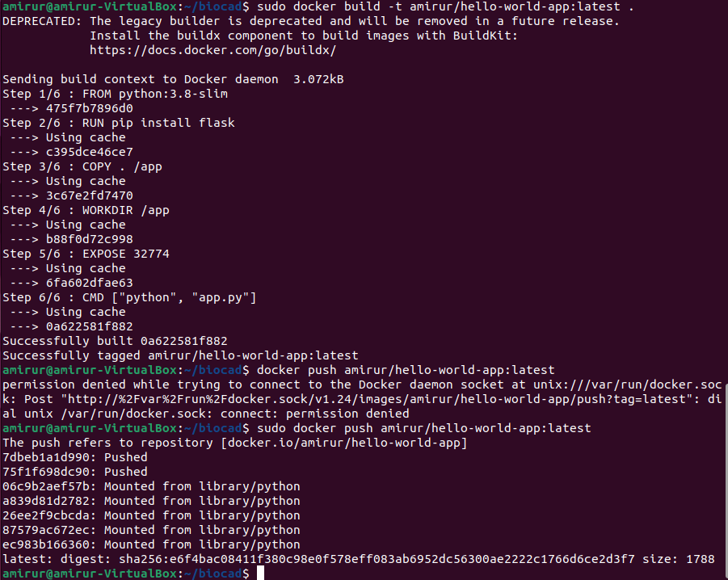
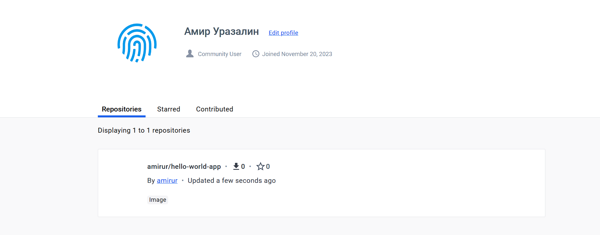
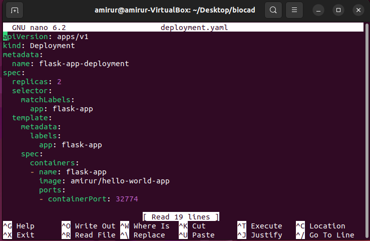
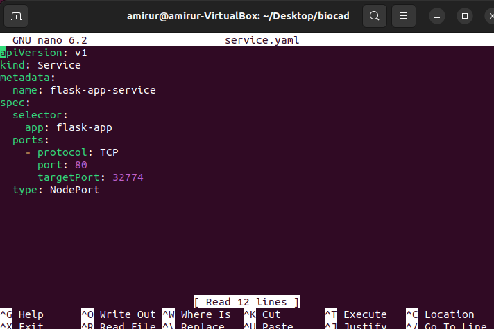
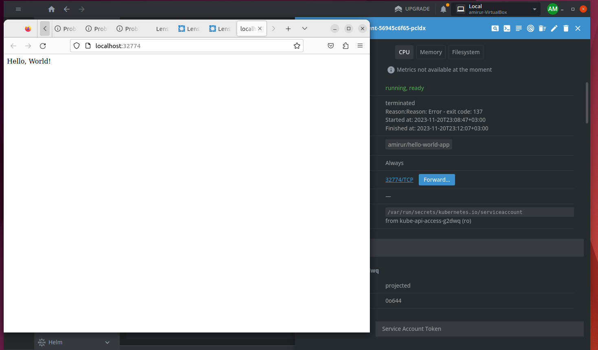
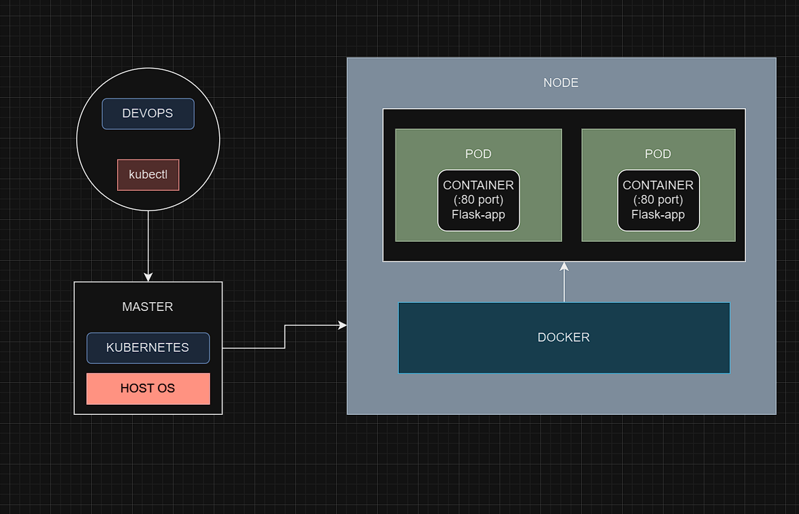

# Тестовое задание на стажировку в Biocad.
## Задание 1.
- Чем git pull отличается от git fetch?
  Это две разные команды в системе управления версиями Git. Git Pull это команда которая обновляет локальную копию кода данными из удаленного репозитория и автоматически объединяет с текущей.
  
  Git Fetch более безопасная команда, которая обновляет локальную копию, но не применяет изменения с текущей.
- Какие модели ветвления git существуют?
  
  Central Workflow (существует единственная ветка Master, которая получает изменения)
  
  Developer Branch Workflow (у каждого разработчика своя изолированная ветка для своих изменений)
  
  Feature Branch Workflow (main ветка - стабильная версия продукта, создание новых функциональностей происходит через отдельные ветки)
  
  Issue Branch Workflow (создание отдельных веток для каждой проблемы/задачи, упрощает отслеживание изменений)
  
  Forking Workflow (все изменения фиксируются на локальной машине разработчика, затем возвращается в основной репозиторий через pull request)

- Чем в linux отличается soft link от hard link? Какое поведение будет при удалении файла оригинала? Можно ли создать hardlink на директорию?
  Soft link - это независимый указатель на файл, а hard link это дополнительное имя для файла, все hard link'и связаны с одним inode.
  Soft link: Если целевой файл перемещается или удаляется, символическая ссылка перестанет работать.
  Hard link: Все hard link'и ссылаются на один и тот же файл. Удаление или перемещение одного hard link'а не влияет на другие, так как они все связаны с одним inode.
  Нельзя создать hardlink на директорию.
-	Как проверить сетевую доступность между двумя linux машинами?
  Самый простой способ: узнать через терминал IP второй машины через ifconfig => ping IP на первой машине
-	Чем контейнер отличается от виртуальной машины?
  Контейнер затрачивает меньше ресурсов чем ВМ.
 	Любой контейнер можно остановить, перезапустить или уничтожить, если это необходимо. (Stateless подход)
  Объем контейнера измеряется в мегабайтах, так как он включает только необходимые зависимости и файлы для запуска приложения. В то время как ВМ занимает значительный объем из-за полной ОС   и приложений.
 	Контейнер легко автоматизировать развертывание сервисов с использованием контейнерных оркестраторов (Kubernetes, Docker Compose)
 	Надежная изоляция процессов.
-	На каких компонентах Linux основана контейнеризация в Docker?
  Пространства имен, cgroups, unionFS, docker daemon(фон.процесс), docker client, docker socket и т.д
-	Опишите составные части архитектуры Docker
-	
  Основные:
 	
  docker server, содержит сервис Docker, образы и контейнеры. Сервис связывается с Registry, образы — метаданные приложений, запускаемых в контейнерах Docker.
 	
  docker client, применяется для запуска различных действий на сервере Docker.
  
  docker registry, используется для хранения образов. Пример публичных: Docker Hub, Docker Cloud.
-	Как устроен образ контейнера?
  Контейнер это упакованный и изолированный "ящик", который обеспечивает надежный и переносимый способ развертывания приложений. В контейнере имеются следующие компоненты: файлы и код,   изолированная среда, образ, мини-ОС, зависимости, конфигурация и параметры.
-	Почему вместо "COPY . . / RUN npm install" рекомендуют делать "COPY package.json / RUN npm install / COPY . ."
  Из-за кэширования, каждая строка создает слой образа. Если package.json не изменился, Docker использует закэшированные результаты предыдущего выполнения этой команды, ускоряя процесс.
-	Что такое под в Kubernetes? Могут ли два контейнера внутри одного пода слушать один и тот же порт?
  Pod - набор контейнеров, объединенных между собой общим Linux Namespace.
  Да, контейнеры могут слушать один и тот же порт, т.к находятся в изолированном пространстве.	
-	Какие виды JOIN знаете и чем они отличаются?
  INNER JOIN (возвращает общие значения между таблицами)
 	
 	LEFT OUTER JOIN (возвращает все записи из 1 таблицы, и те записи во 2 таблице, которые пересекаются с 1)
 	
 	RIGHT OUTER JOIN (возвращает все записи из 2 таблицы, и те записи в 1 таблице, которые пересекаются с 2)
 	
 	FULL OUTER JOIN (возвращает все записи из 1 и 2 таблицы)
 	
-	Что такое having в SQL запросе? Чем отличается от where?
  Having используется для фильтрации данных. Where фильтрует строки до группировки, а Having фильтрует после группировки. Having в основном используется в запросах, использующих агрегатные   функции и операторы GROUP BY.

## Задание 2.
Создание веб-приложения "Hello World" на Flask.

Создание контейнера и публикация на DockerHub.

Написание Deployment с 2 ReplicaSet.

Написание Service.

Запуск minikube, проброс портов, подключение к контейнерам через веб-браузер.

Схема организации контейнеров и сервисов (draw.io)

