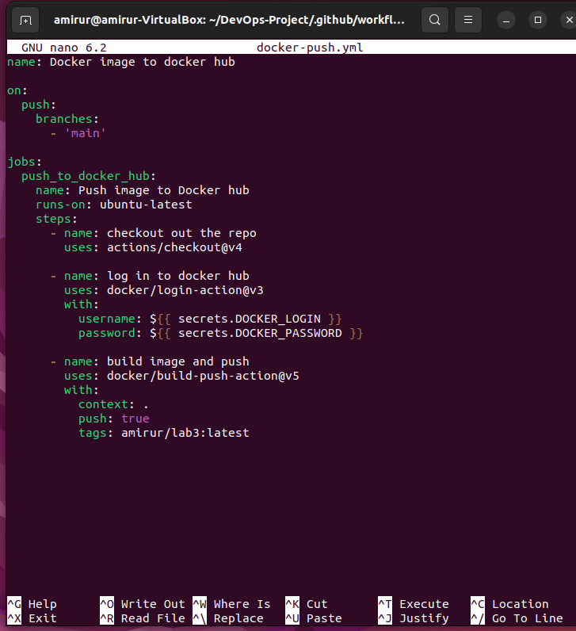
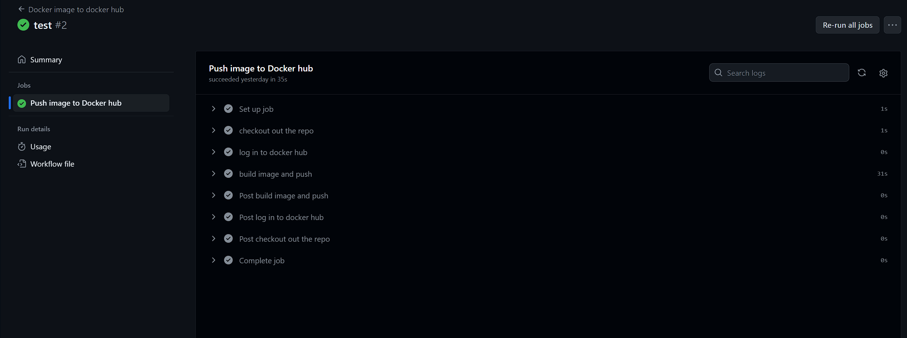
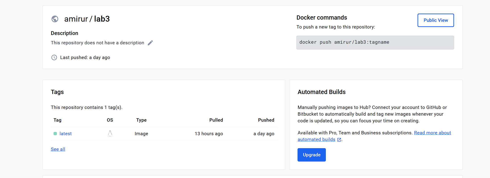

# Лабораторная работа 3. CI/CD

# Техническое задание
Сделать, чтобы после пуша в ваш репозиторий автоматически собирался докер образ и результат его сборки сохранялся куда-нибудь. (например, если результат - текстовый файлик, он должен автоматически сохраниться на локальную машину, в ваш репозиторий или на ваш сервер). 

## 1. Используем готовый репозиторий с написанным сайтом на NodeJS [*Клик*](https://github.com/AmirUr/DevOps-Project)

## 2. Напишем YAML файл для автоматизации сборки докер образа и сохранения его результата на DockerHub.

## 3. Запушим. Подождем проверку тестов.

## 4. Проверим образ на Docker Hub.

Ссылка: https://hub.docker.com/repository/docker/amirur/lab3

Лабораторная работа успешно выполнена!

