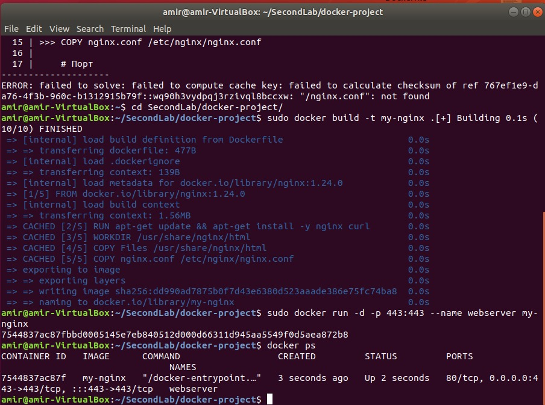

# Лабораторная работа 2. Контейнеризация веб-сервера с использованием Nginx, при поддержке Frontend (HTML, CSS, JS).
# Техническое задание.
Написать два Dockerfile – плохой и хороший. Плохой должен запускаться и работать корректно, но в нём должно быть не менее 3 “bad practices”. В хорошем Dockerfile они должны быть исправлены. В Readme описать все плохие практики из кода Dockerfile и почему они плохие, как они были исправлены в хорошем  Dockerfile, а также две плохие практики по использованию этого контейнера
* (по желанию) Запустить Kubernetes кластер (подойдёт minikube или kind). Запустить ваши контейнеры внутри этого кластера, при этом всё должно быть описано кодом. В минимальном варианте должен быть deployment и service. Приложение, работающее внутри контейнера внутри кластера должно открываться локально у вас в браузере.

## 1. Создадим Dockerfile Bad.

Рассмотрим написанный DockerfileBad.

Очевидны стандартные ошибки в написании докерфайла:
1. Многократное использование команды RUN увеличивает время сборки образа, его размер. Кроме того, увеличивает сложность отладки нашего образа.
2. Многоповторное использование COPY, которое увеличивает размер образа и создает множество слоев, которые тормозят сборку.
3. Использование последней версии NGINX. Это может создавать проблемы совместимости и безопасности, так как последние версии не всегда стабильны и могут быть подвержены потенциальным узявимостям.
   
## 2. Cоздадим Dockerfile Good.

Рассмотрим написанный DockerfileGood.

Желательные "Good practice" в докерфайле:
1. Использование конкретной и стабильной версии NGINX.
2. Обновление файлов и установка пакетов в одну строчку.
3. Определение рабочей директории для команд которые выполняются в контейнере при запуске.
4. Копирование файлов одной командой, а не по отдельности.
5. Использование .Dockerignore, который ускоряет процесс сборки и уменьшает размер образа (в нашем случае для игнорирования JSON файлов, которые не влияют на клиентскую часть)
6. Комментируем каждую частичку кода для повышения читабельности.

## 3. Сравним размеры полученных докер образов после сборки.
"Плохой Докер"

"Хороший Докер"

Как мы видим, правильное написание докерфайла может сохранить около 20 процентов памяти и больше. Кроме того, сохранить наше время.

## 4. Настроим конфигурацию нашего веб-сервера на NGINX.
1. Добавим количество одновременных соединений в блоке EVENTS.
2. Включим поддержку Mime типов (ОБЯЗАТЕЛЬНО!!!).
3. Настроим прослушивание нашего сервера на 443 порт.
4. Установим корневой каталог для обслуживания наших веб-ресурсов.
5. Добавляем обработку CSS и JS файлов, кеширование ресурсов.

## 5. Билдим и запускаем контейнер с веб-сервером.

В браузере делаем запрос на localhost:443 и радуемся нашему рабочему сайту!!! Все статические файлы работают, кнопки прожимаются, можно добавить книги в корзину и перемещаться по сайту!!!

## Лабораторная работа 2 со звездочкой. Coming Soon...

