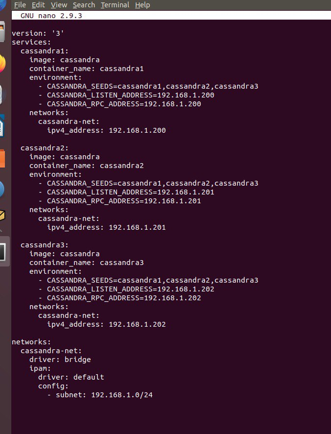
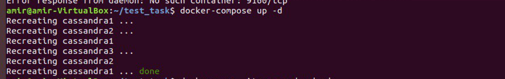
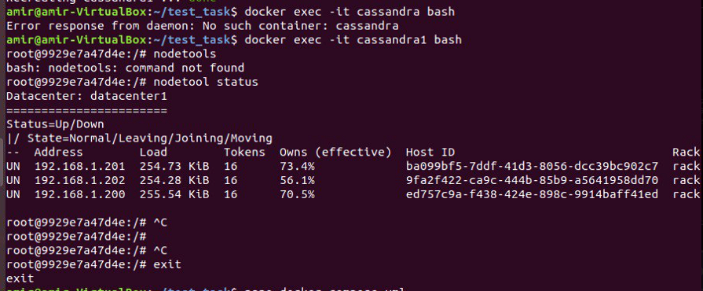
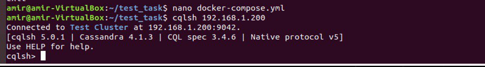
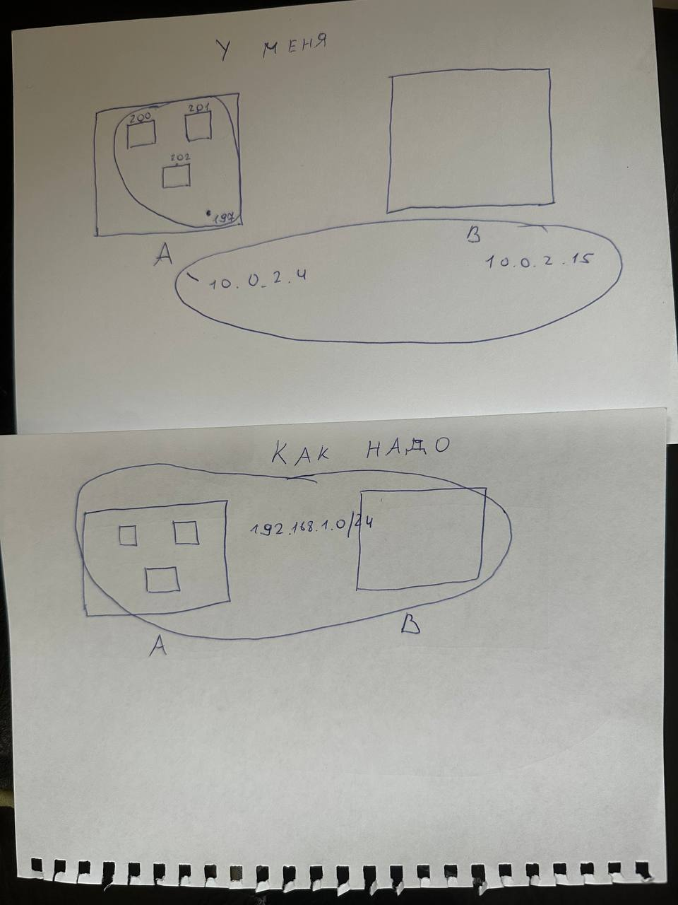
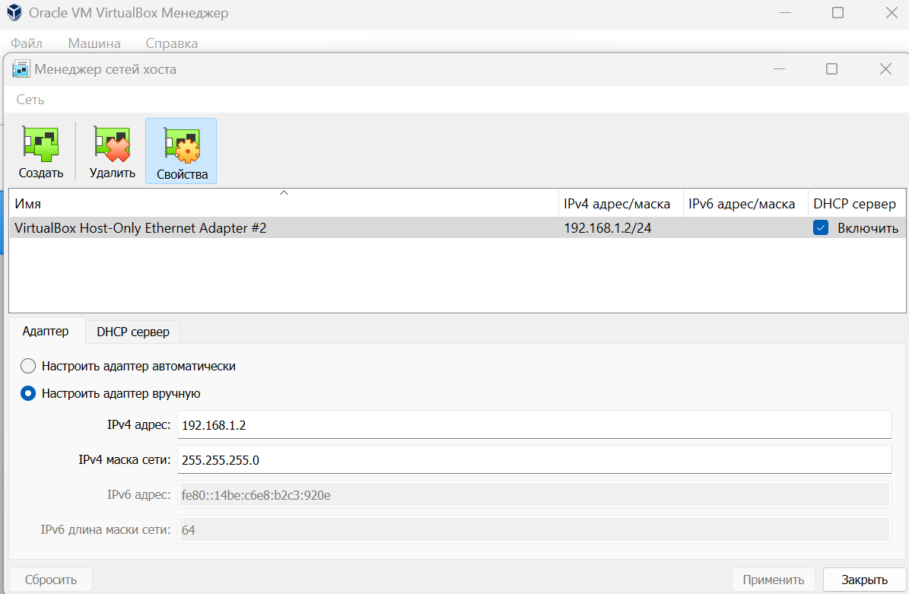
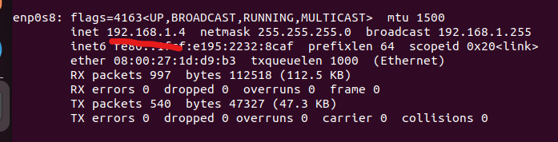
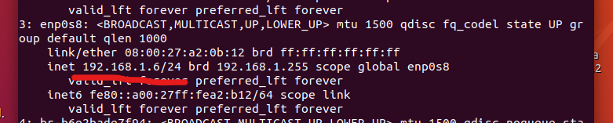
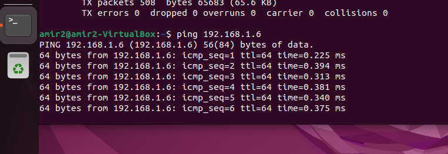

## Техническое задание
Создать Docker Compose скрипт для развертки кластера из трех инстансов cassandra, причем каждый из них должен быть доступен из основной (локальной) сети по отдельному ip адресу.

В ридми добавьте описание, все команды необходимые для запуска и скриншот результата.

Уточнение:
На машине А (ubuntu 22.04 lts) в локальной сети с ip 192.168.1.197 запускается скрипт docker-compose для поднятия 3 образов с ip адресами 192.168.1.200-202. Затем с машины Б (ubuntu 22.04 lts) из той же локальной сети с ip 192.168.1.198 необходимо подключиться через cqlsh к каждой из машин-образов. Все приведённые операции необходимо задокументировать и описать инструкцией с командами и объяснениями.

## Выполнение работы.

Изначально было использовано две виртуальные машины с сетью NAT network. Это позволило каждой виртуальной машине получить уникальный IP-адрес.

Шаг 1. Создадим Docker-Compose.yml и напишем скрипт для развертывания кластера Cassandra с тремя инстансами.

В нем мы определяем 3 инстанса под названиями "cassandra1", "cassandra2", "cassandra3". Каждому инстансу присваиваем официальный образ cassandra, в параметрах среды "environment" связываем все три узла кластера через CASSANDRA_SEEDS. Добавляем адреса для прослушивания и задаем каждому инстансу свой ipv4-адрес.

Настроим сеть для контейнеров. Создадим сеть `cassandra-net`. Укажем мостовой драйвер для создания сети, это позволит контейнерам взаимодействовать между собой и с хостовой системой. Кроме того, настроим конфигурацию сети, укажем, что контейнеры будут работать в подсети 192.168.1.0/24, это означает что сеть будет использовать адреса от 192.168.1.1 до 192.168.1.254

Шаг 2. Запустим docker-compose файл. Развернем кластер. Проверим состояние кластера.

Используем команду `-docker-compose up -d`, которая позволит запустить кластер в фоновом режиме.

После того, как загорелась зеленая кнопка DONE. Можно проверить состояние контейнеров через команду `-docker ps`.

Либо можно напрямую войти в оболочку любого из контейнеров и проверить их подробное состояние. Используя следующие команды:
`docker exec -it cassandra1 bash`

`nodetool status`

Шаг 3. Подключимся к нашим инстансам через cqlsh.

Для начала попробуем подключиться через cqlsh с первой виртуалки, с которой же и запускали контейнеры. Используя следующую команду:

`cqlsh 192.168.1.200`

Как мы видим все получилось. Но если эту же команду использовать на второй виртуальной машине, получим ошибку. 
Траблшутинг в виде проброса портов, настройка firewall не привел к ожидаемым результатам.
Использовались команды:

`sudo ufw allow 9042/tcp`

`firewall-cmd --new-zone=cassandra-cluster --permanent`

`firewall-cmd --zone=cassandra-cluster --add-source=192.168.1.0/24 --permanent`

`firewall-cmd --zone=cassandra-cluster --add-port=9042/tcp --permanent`

`firewall-cmd --reload`

Далее был составлен концептуальный план, после которого было, возможно, понятно, в чем ошибка.

Шаг 4. Настройка виртуальных машин.

Настроим каждую виртуальную машину на сеть NAT + Host-only Ethernet adapter. Это позволит каждой виртуалке выдать IP адреса в подсети 192.168.1.0/24. 

После захода на каждую виртуальную сеть появятся новые корректные IP-адреса такие как: 192.168.1.6 и 192.168.1.4. А главное, они находятся в одной подсети с контейнерами.

Можно проверить связь между ними и пропинговать. Пакеты успешно передаются и контакт между виртуалками установлен.

