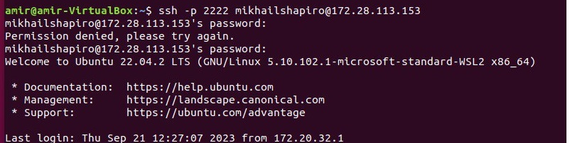
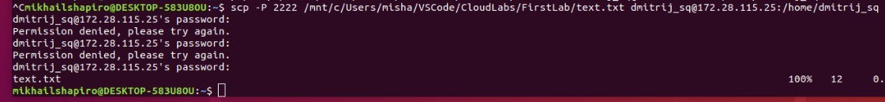
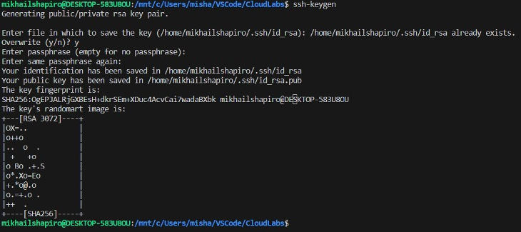

# Лабораторная работа №1.

# Техническое задание.
Пользуясь терминалом на компьютере А перенести файл с компьютера Б на компьютер С, находящиеся в одной локальной сети. (Подсказка: вам понадобится ssh).

Просьба использовать MacOS/Linux/WSL.

* (по желанию) Сделать аналогичное, но подключаться при помощи публичных и приватных ключей, а не по логину паролю.

## 1. Подключаем все 3 уcтройства к общей сети

В работе использовалось два ПК с WSL и один с ОС Linux (На виртуальной машине). Все устройства были подключениы к общему Wi-Fi, 
так же на всех устройствах были разрешены все параметры общего доступа, в том числе и общий доступ к файлам для возможности передавать их между устройствами. Также был отключён брандмауэр в настройках Windows.

IP устройств были найдены с помощью команды `ipconfig`, в разделе *"Адаптер беспроводной локальной сети Беспроводная сеть"*, строка "*IPv4-адрес*" (см. рисунок 1).
В таблице ниже приведены все IP

|Устройство|IP|
|----------|--|
|PC A|172.28.114.254|
|PC B|172.28.113.153|
|PC C|172.28.115.25|

С помощью команды `ping IP` проверяем видят ли ПК IP из списка (см. рисунок 2).

Все три устройства видят друг друга, значит подключение к локальной сети было успешно выполнено.

## 2. Настройка WSL для принятия запросов на подключение к серверу.

В WSL 2 имеется виртуализированный адаптер Ethernet с собственным уникальным IP-адресом. Его можно найти с помощью команды `ifconfig` в консоле WSL. Так как запросы на подключение приходят по IP адрессу Windows, нам нужно направить их в WSL. Делается это в PowerShell (открытого от имени администратора) с помощью команды:

`netsh interface portproxy add v4tov4 listenaddress=0.0.0.0 listenport=2222 connectaddress=IP(X.X.X.X) connectport=2222`

**ВАЖНО!** В данной команде нужно вводить именно IP виртуальной машины WSL 2. Найти его можно, если зайти в WSL и прописать `ifconfig`. В графе eth0, пункт inet будет нужный IP адресс.

Таккая команда добавляет прокси-сервер портов, ожидающий передачи данных на порту узла 2222 и перенаправляющий все подключения на порт 2222 виртуальной машины WSL 2 с IP-адресом X.X.X.X Будем использовать порт 2222, так как некоторые публичные сети могут блокировать порт 22 (Стандартный порт).

С помощью команды `netsh interface portproxy show v4tov4` проверяем, что прокси-сервер был успешно добавлен (см. рисунок 3)

В завершении настраиваем правила брандмауэра с помощью команды:

`netsh advfirewall firewall add rule name=”Open Port 2222 for WSL2” dir=in action=allow protocol=TCP localport=2222`

## 3. Загрузка и настройка сервера Openssh-server

Устанавливаем openssh-server командой `sudo apt-get install openssh-server` (Если ещё не установлен). Так как мы изменили порт на 2222, нам нужно его поменять и на сервере. Так как сервер порт задаётся в конфиге, меняем конфиг с помощью команды `sudo nano /etc/ssh/sshd_config`. Меняем строку `#Port 22` на `Port 2222` (Обязательно убрать решётку) и сохраняем конфиг - Нажимаем Ctr + X Потом Y Потом Enter (см. рисунок 4).

Запускаем сервер командой `sudo service ssh start` или перезагружаем его с помощью `sudo service ssh restart`. После изменения порта обязательно нужно перезапустить сервер. Проверяем, что сервер стал активным командой `service ssh status` (см. рисунок 5-6). На некоторых устройствах выводятся сокращённые сообщения о том, что сервер активен

## 4. Подключение к серверу по SSH и копирование файлов

Для того, чтоб подключиться к серверу по SSH, нужно знать имя пользователя и IP (IP был найден в начала). Чтоб узнать имя пользователя, достаточно ввести команду `cat /etc/passwd` (см. рисунок 7-8). Выводится полный список всех пользователей, в отличие от `whoami`. Если нужен именно конкретный пользователь, за которого вы сидите сейчас, то подойдёт `whoami`.

Пользователь на PC A - *amir*

Пользователь на PC B - *mikhailshapiro*

Пользователь на PC C - *dmitrij_sq*

Теперь все пользователи известны и пользователь *amir* может подключиться к пользователю *mikhailshapiro* на сервере PC B. Выполняется это спомощтю команды (см. рисунок 9):

`ssh -p 2222 username@ip`

Так как мы изменили порт на 2222, нужно прописывать в команде `-p 2222` (-p чувстивителен к регистру и в команду ssh нужно прописывать именно маленькую -p)

После подключения к серверу на PC B, нам нужно передать файл на PC C - пользователю *dmitrij_sq*. Делается это с помощью команды (см. рисунок 10):

`scp -P 2222 path1 username@ip:path2`

В данном случае path1 - путь к файлу у пользователя *mikhailshapiro* на PC B, username - пользователь PC C *dmitrij_sq*, ip PC C и path2 - путь к папке, в которую будет скопирован файл (-P также чувствителен к регистру, в scp нужна заглавная -P).

Проверить, что всё скопировалось корректно можно, прописав команду `cat filename`, она выведет всё содержимое файла в консоль (см. рисунок 11-12).

## Задание со звёздочкой

Для выполнения задания со звёздочкой понадабятся те же устройства и те же команды, но сейчас будем делать подключение через **ssh key**, что позволит заходить на сервер, не вводя пароль. (IP изменились, так как делали задания в разные дни)

|Устройство|IP|Name|
|----------|--|----|
|PC A (*amir*)|IP|172.20.10.6|
|PC B (*mikhailshapiro*)|IP|172.20.10.4|
|PC C (*roman*)|IP|172.20.10.5|

Для начала нужно создать ключи на устройствах, с которых мы будем подключаться - PC A и PC B. Делается это с помощью команды `ssh-keygen`, везде прожать просто Enter (см. рисунок 13-14)

Чтоб убедиться, что ключ создался, нужно ввести команду `cat /etc/ssh/ssh_host_rsa_key.pub` - публичный ключи и `sudo cat /etc/ssh/ssh_host_rsa_key` - приватный ключ (см. рисунок 15).

Далее нам нужно загрузить ключи на сервер. Делаем это с помощью команлы `ssh-copy-id name@ip` и тогда мы сможем зайти на него без ввода пароля (см. рисунок 16). При копировании ключа нас просят ввести пароль, но позже нам не нужно будет это делать.

Убедимся, что ключи загрузились на сервер, можно это сделать с помощью команды `cat ~/.ssh/authorized_keys`. Также мы можем увидеть того, кто загрузил ключ на сервер (см. рисунки 17-18).

Если мы попытаемся подключиться к серверу или скопировать файл, то нас всё равно попросит ввести пароль (см. рисунок 19)

Для того, чтоб всё равботало, на сервере нужно изменить конфиг ssh. Открываем конфиг с помощью `sudo nano /etc/ssh/sshd_config` и меняем строку **PasswordAuthication** с *yes* на *no*, также раскоментируем её (см. рисунок 20).

Далее выполняем всё, что делали раньше. Подключаемся от ПК amir на сервер mikhailshapiro через ssh (см. рисунок 21). В этот раз пароль у нас уже не запрашивается

Команда немного отличается (Добавляется `-i path`), мы указываем путь, где хранится ключ для ssh, чтоб понимать, что нужно для аутентификации на сервере

Потом мы должны скопировать файл с ПК mikhailshapiro на ПК roman. В этот раз ничего переделывать не пришлось, всё сработало без ошибок. Ключ не просили ввести (см. рисунок 22)

Проверяем, есть лю файл в диретории `la`. Файл найден - значит работа выполнена (см. рисунок 23).

